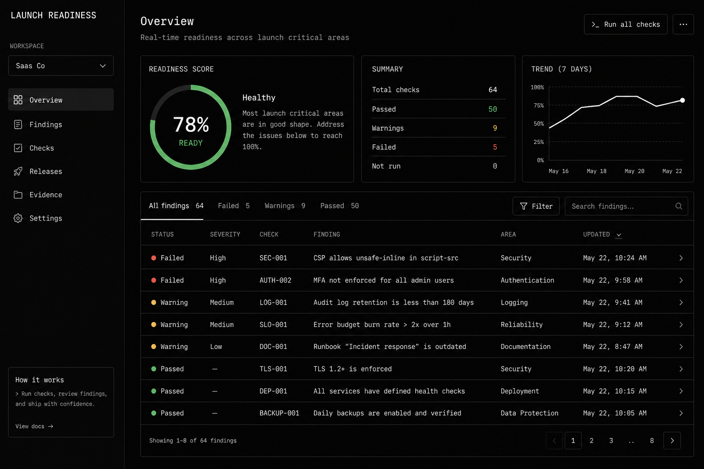
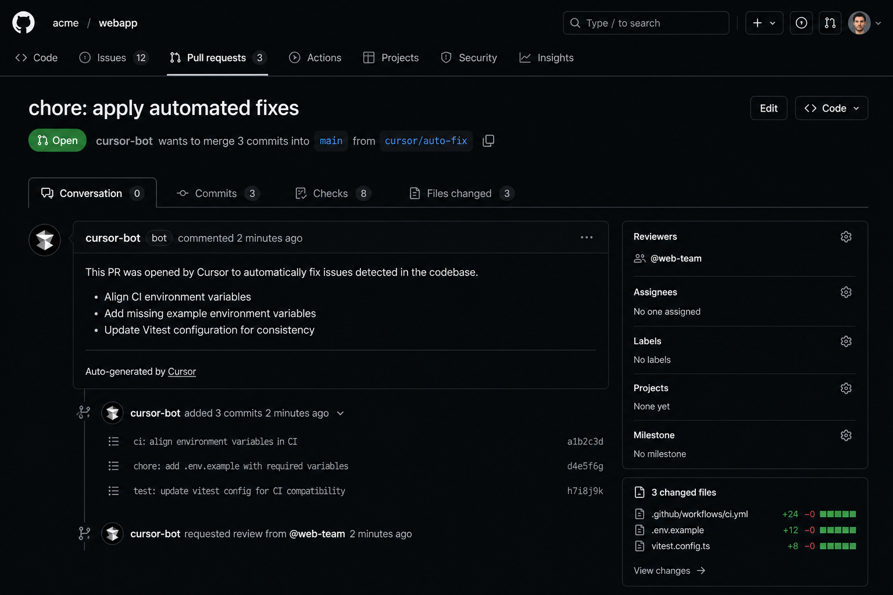

<p align="center">
  
</p>

<h1 align="center">LaunchReadyy Community</h1>

<p align="center"><strong>Self-hosted evidence for production readiness.</strong></p>

<p align="center"><a href="docs/README.md">Documentation</a> · <a href="CONTRIBUTING.md">Contributing</a></p>

LaunchReadyy Community is a self-hosted production-readiness and verification tool for software
repositories. It scans applications, identifies release risks, verifies builds in isolated E2B
environments, produces evidence-backed readiness results, and can generate remediation pull
requests.

It is a single-operator application. You run it locally or on infrastructure you control, connect
it with your own GitHub token, and optionally supply E2B and AI-provider API keys. Application data
stays in the local SQLite database.

## Features

- Production-readiness scoring across architecture, testing, deployment, operations, and security
- Evidence and confidence attached to findings, including affected files and recommended fixes
- Repository security checks for secrets, unsafe APIs, auth gaps, webhooks, headers, and dependencies
- Passive live-site checks for confirmed domains
- Isolated install, build, lint, and test verification through E2B
- Deterministic and AI-assisted remediation with reviewable GitHub pull requests
- AI-generated tests informed by the repository's actual source and dependency graph
- Architecture analysis, scan history, and scheduled repository monitoring
- Encrypted per-repository environment variables for sandbox runs

## Screenshots

| Readiness analysis | Verified remediation |
| ------------------ | -------------------- |
|  |  |

## Requirements

- Node.js `^20.19.0` or `>=22.13.0`
- Git
- Rust and `wasm-pack` for the repository indexer build
- A GitHub personal access token with `repo`, `read:user`, and `workflow` scopes

## Install and run locally

```bash
git clone https://github.com/g0GobliN/launchreadyy.git
cd launchreadyy
npm install
npm run build
npx launchreadyy setup
npx launchreadyy start
```

`launchreadyy setup` writes the local configuration interactively. Open
`http://localhost:5174` after the server starts. Run `npx launchreadyy doctor` to validate the
installation and configured providers.

For development:

```bash
npm run dev
```

## Configuration

Copy [`.env.example`](.env.example) to `.env`, or use `launchreadyy setup`.

| Setting | Purpose | Required |
| ------- | ------- | -------- |
| `GITHUB_TOKEN` | Reads repositories and creates branches and pull requests | For repository operations |
| `SESSION_SECRET` | Signs the installation's local session | Yes |
| `ENV_VAR_ENCRYPTION_SECRET` | Encrypts sandbox environment variables at rest | When saving project variables |
| `E2B_API_KEY` | Runs isolated install/build/lint/test verification | No |
| `AI_PROVIDER` and provider key | Generates fixes, tests, and explanations | No |
| `APP_URL`, `HOST`, `PORT` | Controls the installation URL and server binding | No |

Without E2B, verification is reported as skipped. Without an AI provider, deterministic scanning,
scoring, and template fixes continue to work.

## Self-hosting

The production build runs as one Node.js process containing the web server, server functions,
background job worker, and scheduler. Persistent data is stored in `data/launchreadyy.db`.

```bash
npm run build
npm run start
```

The default bind address is loopback. If you expose the application on a network, place it behind
an authenticating reverse proxy and protect the `data/` directory and `.env` file. See the
[deployment guide](docs/guides/deployment.md) and
[production guide](docs/guides/production.md).

## Security and privacy

- Repository and provider credentials are read server-side and are never sent to the browser.
- Saved project variables are encrypted with AES-256-GCM before being stored.
- Live-site scanning requires domain ownership confirmation.
- The application sends source excerpts only to the AI provider you configure and only for
  AI-assisted operations.
- No telemetry is included.

Report vulnerabilities according to [SECURITY.md](SECURITY.md). The complete data-handling model is
documented in [the security reference](docs/reference/16-security.md).

## Documentation

- [Documentation hub](docs/README.md)
- [System architecture](docs/reference/02-system-architecture.md)
- [Environment variables](docs/reference/15-environment-variables.md)
- [Operations](docs/guides/operations.md)
- [API reference](docs/reference/14-api.md)

## Contributing

See [CONTRIBUTING.md](CONTRIBUTING.md). Before opening a pull request, run:

```bash
npm run typecheck
npm run lint
npm test
```

## License

LaunchReadyy Community is licensed under Apache-2.0. See [LICENSE](LICENSE) and
[TRADEMARKS.md](TRADEMARKS.md).
