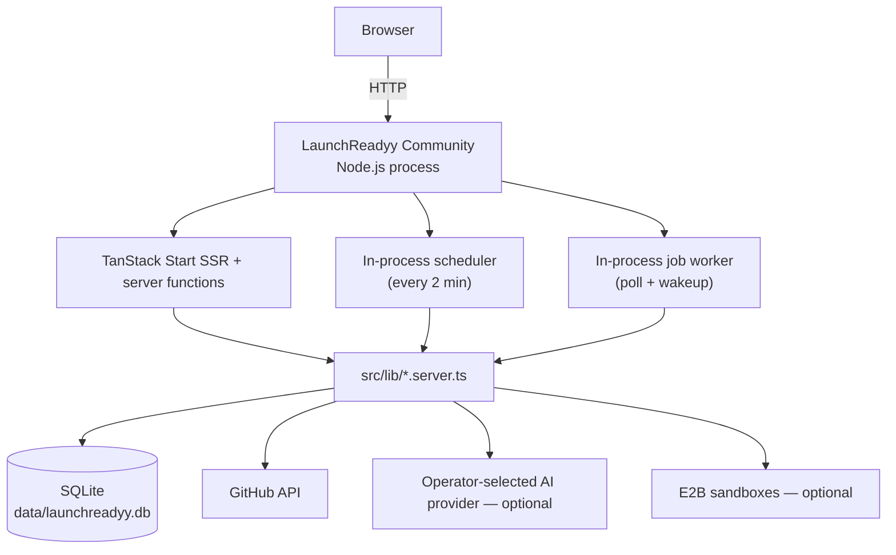
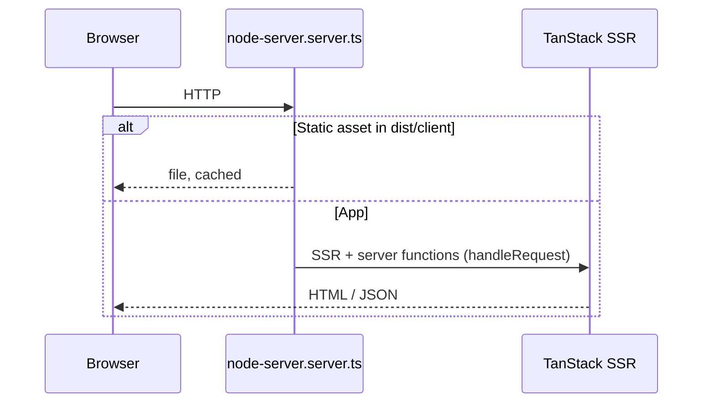
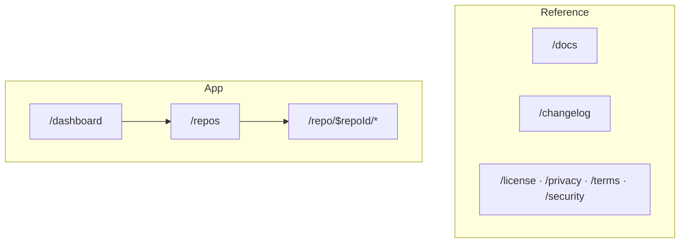
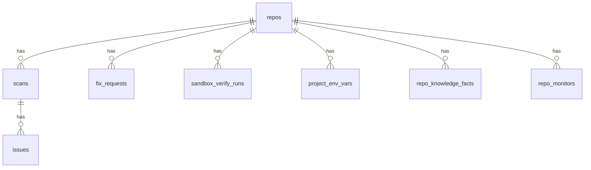
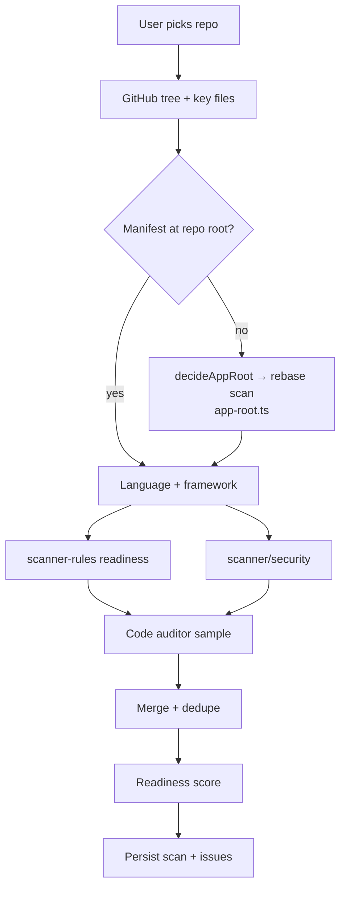
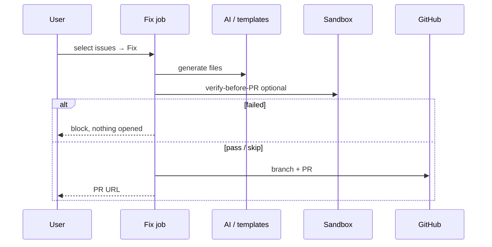
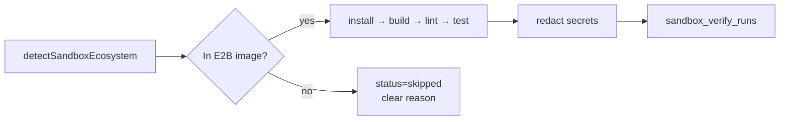
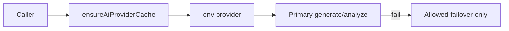
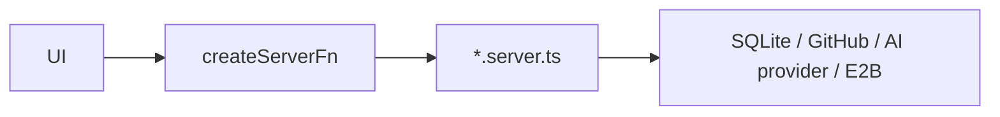
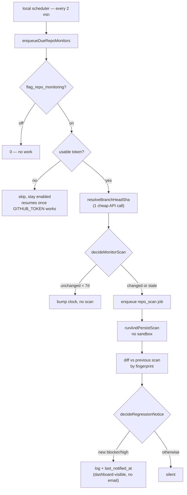

# LaunchReadyy — Full documentation

> **Generated.** Do not edit this file. Edit chapters in `docs/reference/`, then run `npm run docs:build`.

Generated: 2026-09-24

---

# 1. Overview

**LaunchReadyy Community** is self-hosted, open-source software that scans GitHub repositories for
production readiness, scores them, and opens one-click fix PRs. It is built for a single operator
using infrastructure and provider credentials they control.

## Purpose

Close the gap between "AI wrote a working app" and "safe to ship" — tests, CI, Docker, secrets
hygiene, security middleware, and evidence-backed findings.

## Core features

| Feature               | What you get                                              |
| --------------------- | --------------------------------------------------------- |
| Readiness score       | 0–100 with category breakdown                             |
| Production Security   | Secrets, auth gaps, CORS/headers, OSV — with evidence     |
| Live website scan     | Passive checks on domains you confirm you own             |
| One-click fix PRs     | Template + AI-generated files committed via GitHub        |
| Sandbox verify        | E2B install/build/lint/test before/after fixes (optional) |
| Architecture analysis | Import-graph structural audit                             |

## Product components

| Path            | What it is                                                          |
| --------------- | ------------------------------------------------------------------- |
| `src/routes/`   | UI (TanStack Start) — app + reference pages, no auth split          |
| `src/lib/`      | Server logic — scan, fix, sandbox, database                         |
| `src/ai/`       | AI router + providers (deepseek, anthropic, openai, gemini, cursor) |
| `src/db/`       | SQLite schema, migrations, query client                             |
| `launchreadyy/` | E2B sandbox template                                                |
| `rust/`         | Optional indexer crate (WASM)                                       |

Repository:
[github.com/g0GobliN/launchreadyy](https://github.com/g0GobliN/launchreadyy).

---

# 2. System Architecture

LaunchReadyy Community runs as one Node.js process containing the web server, background job
worker, and scheduler. The first request starts the background services through
`startBackgroundServices()` in `src/server.ts`; the poll loop in `src/lib/jobs.server.ts` drains
durable jobs and runs scheduled work.



## Request path



## Data + control flows

| Flow | Entry | Side effects |
| ---- | ----- | ------------ |
| Scan | Server fn → `runScan` | `scans`, `issues`, knowledge facts |
| Fix | Durable job | AI/templates → optional sandbox → GitHub PR |
| Sandbox | Durable job | `sandbox_verify_runs`, score gating |
| Live site | Durable job | `live_site_scans` |
| Repo monitoring | Scheduler tick | re-scan, regression notice — [§18](18-monitoring.md) |

Details: scan [§10](10-scan-system.md), fix [§11](11-fix-system.md), sandbox [§12](12-sandbox.md), AI [§13](13-ai-layer.md).

---

# 3. Technology Stack

| Layer | Choice |
| ----- | ------ |
| UI | React 19 + TanStack Start / Router / Query |
| Styling | Tailwind CSS 4 + Radix (shadcn-style) |
| Backend | Same repo — server functions + `src/server.ts` |
| Hosting | Local Node.js server |
| Database | SQLite, always local (`data/launchreadyy.db`) |
| Identity | Single operator — GitHub personal access token, no login |
| AI (optional) | DeepSeek, Claude, OpenAI, Gemini, or Cursor — pick one |
| Sandbox (optional) | E2B disposable VMs |
| Tests | Vitest · Playwright smoke |
| Deploy | `npm run build && npm run start` |

Node: `^20.19.0 || >=22.13.0` (see `package.json` `engines`).

---

# 4. Repository Layout

```
src/
  routes/           Page routes (file-based) — app + reference, no auth split
    repo.$repoId.*  Per-repo scan / fix / sandbox / report
  components/       React UI
  ai/               Router + providers + agents
  db/               SQLite schema, migrations, query client
  lib/              Server domain logic
    scan-engine/    Fetch tree + runScan
    scanner/        Security + AST + integrations
    readiness/      Score + categories
    sandbox/        Commands, env, redaction
    sandbox-verify/ Job + verify-before-PR
    fix-executor/   Templates + PR open
    api/            createServerFn modules
    jobs.server.ts  Durable queue
    node-server.server.ts  Node HTTP front end (static files + SSR)
  cli/              `launchreadyy` CLI (setup, doctor, start, config)
launchreadyy/       E2B template build
rust/               Indexer crate (optional)
scripts/            verify tools, docs build, benches
docs/
  README.md         Docs hub (start here)
  reference/        Wiki chapters (source of truth)
  guides/           Procedures
  FULL_DOCUMENTATION.md  Generated — do not edit
```

Do not hand-edit `src/routeTree.gen.ts` — TanStack regenerates it.

---

# 5. Frontend

File-based routes under `src/routes/`. Loaders + TanStack Query for data; no separate global store.

## Route map

There's no auth split — every route is reachable by the one local operator. Reference pages
(`/docs`, `/changelog`, `/license`, …) sit alongside the app in the same file-based route tree; the
public landing site is a separate deployment under `site/` and is not a route here.



| Path | Purpose |
| ---- | ------- |
| `/` | Redirect to `/dashboard` |
| `/docs` · `/changelog` | Reference UI |
| `/license` · `/privacy` · `/terms` · `/security` | Legal and policy pages |
| `/dashboard` | Home base across connected repos |
| `/repos` · `/scans` · `/reports` | Cross-repo lists |
| `/repo/$repoId` | Scan overview |
| `/repo/$repoId/fix` | Fix picker |
| `/repo/$repoId/blockers` | Launch verdict |
| `/repo/$repoId/sandbox` · `/repo/$repoId/runs` | Sandbox trigger + build history |
| `/repo/$repoId/env` | Encrypted env vars |
| `/repo/$repoId/live-security` | Live domain scan |
| `/repo/$repoId/arch` | Architecture analysis |
| `/repo/$repoId/report` | Shareable report |
| `/repo/$repoId/job/$jobId` | Fix job detail |
| `/pr/$repoId` | Public shared launch report |
| `/settings` | Vendor credentials, background monitoring, data, security |

Public product docs UI: `/docs` (in-app help center). `/changelog` is a static list of product
updates, not a content feed. Repo technical docs: `docs/` in git. Marketing pages live in `site/`,
not in this route tree.

---

# 6. Backend

## Entry point (`src/server.ts`)

A single `handleRequest(request: Request): Promise<Response>` — the only export. It boots the
background halves (scheduler + job worker) on first call, then runs the request through
TanStack Start SSR. `node-server.server.ts` is what actually calls it: it serves `dist/client`
directly for static assets and hands everything else to `handleRequest`. See
[§2](02-system-architecture.md).

There is no separate queue consumer or scheduled-function entry point — the in-process poll loop
in `src/lib/jobs.server.ts` drains durable jobs and covers repo/live-site monitoring
([§18](18-monitoring.md)) on its own timer.

## Server functions

Business logic is exposed via `createServerFn` in `src/lib/api/*.functions.ts`, which call
`*.server.ts` modules. See [§14 API](14-api.md).

## Errors

Thrown errors from server functions surface as UI errors. There's no separate runtime normalizing
error responses — Node's own error handling in `node-server.server.ts` and TanStack Start's SSR
error boundary cover it.

---

# 7. Database

Single source: [`src/db/migrations/`](../../src/db/migrations/), applied automatically on boot
(`ensureSchema()` in `src/db/schema.ts`) — no manual step, no external database to provision.
Local SQLite file at `data/launchreadyy.db` (WAL mode, foreign keys on).

Retiring a feature means retiring its table too: `src/db/schema-coverage.test.ts` fails when a
table the migrations leave behind has no reader left in `src/`, so a dead table cannot outlive its
code.

`src/lib/data-store.server.ts` provides a typed query-builder interface over `better-sqlite3`.
`src/lib/data-store.types.ts` holds the corresponding row types.



## Core tables

| Table | Holds |
| ----- | ----- |
| `repos` | Connected GitHub repos |
| `scans` | Scan rows, scores, file hashes, graphs, `trigger` (`manual` \| `monitor`) |
| `issues` | Findings (fingerprint, evidence, fix_id) |
| `fix_requests` | Fix jobs, pending files, agent_reasoning |
| `background_jobs` | Durable job source of truth — claim/retry/reclaim, see [§11](11-fix-system.md) |
| `sandbox_verify_runs` / `sandbox_slots` / `sandbox_audit_log` | Sandbox status, logs, concurrency slots |
| `project_env_vars` / `project_build_settings` | Encrypted per-repo secrets and build config |
| `repo_knowledge_facts` | Tiered knowledge extracted per scan |
| `live_site_scans` / `live_site_monitors` / `domain_scan_confirmations` | Live security scans and domain ownership |
| `repo_monitors` | Scheduled re-scan state (cadence, last head SHA, last alert) — [§18](18-monitoring.md) |
| `site_config` | Installation notices and maintenance state |
| `risk_acceptances` | Accepted risks / repo learning |
| `category_score_history` / `arch_scans` / `fix_cache` / `ai_test_cache` / `ai_usage` | Trend, caching, and usage bookkeeping |
| `rate_limit_hits` / `short_locks` | Rate limiting and scheduled-work locks |
| `fix_recoveries` / `launch_reports` | Remediation recovery and shareable reports |

## Security model

Single local process, single operator — there's no separate database credential to leak and no
row-level security to configure. Saved project environment variable values are encrypted at rest
(AES-256-GCM, keyed off `ENV_VAR_ENCRYPTION_SECRET`) so a copy of the `.db` file alone doesn't
yield those secrets. `GITHUB_TOKEN` stays in local configuration and is not stored in SQLite.

---

# 8. Identity

There is no login. LaunchReadyy Community is single-operator: whoever runs the process is the
only user, identified by `LOCAL_USER_LOGIN` in config (cosmetic only, never verified) and
authorized to GitHub via a personal access token (`GITHUB_TOKEN`) read server-side.

`src/lib/auth.server.ts` applies ownership guards — `assertRepoOwner`, `assertJobOwner`, and
`assertScanOwner` — even with one identity. They stop a
stale repo id in an old tab from touching another installation's data if two operators ever share
a database, and the rate limiter still protects the operator's own GitHub/E2B/AI accounts from a
retry loop. `requireAuthUser()` always resolves to the local operator; it never fails.

`getLocalUser()` in `github-token.server.ts` is the identity source.

---

# 9. Costs and limits

LaunchReadyy Community does not impose product-level repository, scan, or remediation limits.
The installation uses infrastructure and API keys supplied by its operator.

| Provider | Required | Limit or cost owner |
| -------- | -------- | ------------------- |
| GitHub | For repository operations | GitHub API and account limits |
| E2B | No | E2B sandbox usage and concurrency |
| AI provider | No | The configured provider's token usage and rate limits |

`SANDBOX_MAX_CONCURRENT` limits simultaneous verification runs so the installation cannot start
more work than the operator intends. See [§12](12-sandbox.md).

---

# 10. Scan system

Entry: `runScan` in `src/lib/scan-engine/scan-repository.ts`.



## Notes

- Framework-aware rules (Next, Express, Go, Python, …).
- Code-pattern security checks (`scanner/security/code-patterns.ts`): disabled TLS verification, predictable randomness behind tokens, weak crypto over credentials, path traversal, open redirect, NoSQL injection — across JS/TS, Python, Go, Ruby and PHP.
- GitHub Actions workflows are checked for script injection, `pull_request_target` misuse, token permissions and unpinned actions (`scanner/security/workflow-security.ts`); Dockerfiles for root containers, layer-baked secrets and piped installs (`container-security.ts`). Both read files the scan fetches by name — workflows and Dockerfiles are config, so the auditor source sample never contains them.
- Every finding carries evidence + confidence.
- Knowledge facts written when `flag_repo_knowledge_v2` is on.
- Learning filter (`applyLearning`) suppresses accepted risks on later scans.
- Scans are **not only user-initiated**. `runAndPersistScan` (`scan-run.server.ts`) is the shared path; a manual `triggerScan` also enqueues sandbox verification, scheduled monitoring does not. `scans.trigger` records which. See [§18](18-monitoring.md).
- `checkDependabotAlerts` queries GitHub's live advisory API each run, so findings can change with no commit — this is what makes scheduled re-scans worth running.
- Dependency vulnerabilities come from lockfiles, not manifests. `collectDependencies` (`scanner/security/dependency-inventory.ts`) parses every lockfile in the tree — npm, PyPI, Go, crates.io, RubyGems, Packagist, Hex, NuGet — and OSV is queried with the exact installed versions, transitive ones included. Ranges in `package.json` are used for framework detection only; they cannot answer which version shipped.

## Apps that are not at the repository root

Root detection runs first and always wins when it resolves, so a single-app repo behaves exactly
as it always has. Only a root that resolves to nothing — or a workspace coordinator with no app of
its own (`workspaces`, `pnpm-workspace.yaml`, `turbo.json`, `nx.json`) — looks deeper.

| Concern | Behaviour |
| ------- | --------- |
| Which app | `decideAppRoot` ranks candidates; a backend outranks a frontend, since readiness and security are mostly server properties |
| Scan scope | Rebased onto that directory via `rebaseProvider` — the app is scanned as if it were the root |
| Secrets | **Always whole-repo.** `sampleRepoForSecrets` sweeps every directory regardless of the app dir, so a monorepo cannot hide a key in a sibling package |
| Other apps | Named in a scan warning so the user knows what was not covered |
| Fixes | Generated beneath the same directory — the fix executor resolves it too. See [§11](11-fix-system.md) |
| Empty repo | No manifest and no source anywhere → `UNSUPPORTED_REPO:` warning and score 0, never a fake 100 |

Regression guard: `scripts/scan-baseline.ts` freezes score/framework/fix-ids for every fixture.
`check` exits non-zero on any drift, so it can fail a pipeline; re-run with `write` once the change
is confirmed intended. It runs nightly (`.github/workflows/detection-baseline.yml`), deliberately
not per push: the fixtures are shallow clones of third-party repos, so their contents move when
those upstreams commit, and a guard that fails PRs for reasons nobody here can fix gets ignored.

---

# 11. Fix system



## Pipeline pieces

| Step | Module |
| ---- | ------ |
| Collect templates | `fix-executor/body/` |
| AI tests / README / CI | `ai-tests.server.ts` + `route()` |
| Knowledge inject | `loadRepoKnowledgeContext` |
| Multi-agent trail | `agent-fix.server.ts` (flag off by default) |
| Pre-PR verify | `sandbox-verify/verify-before-pr.ts` |
| Open PR | GraphQL → Trees REST → Contents fallback |
| CI recovery | `ci-watch.server.ts` / fix-recovery |

Lint-only fixes run deterministically with no AI involved; the rest call whichever AI provider
you've configured (or apply a fixed template, also no AI).

## Apps that are not at the repository root

`buildProjectContext` resolves the same app directory the scan did (`scan-engine/app-root.ts`)
and reads `package.json`, manifests and the package manager from **there**, not from a workspace
root that isn't the app.

`collectFixFiles` then places output beneath it. Handlers pass two kinds of path and both keep
working: a constant (`"Dockerfile"`, `"health.py"`) is moved under the app; a path discovered
from the repo tree (`entryPoint`, an auditor target) is left alone, or it would become
`backend/backend/app/main.py`. They are told apart by fact — a path already present in the repo,
or already under the app directory, is used verbatim.

| Output | Location |
| ------ | -------- |
| Build/config/source (`Dockerfile`, `ruff.toml`, `health.py`, middleware) | under the app directory |
| `.github/workflows/**` | repository root (GitHub only reads it there) |
| `README.md`, `.env.example`, `.gitignore`, `LICENSE` | repository root |
| `package.json` script/dep merges | the **app's** manifest, via `patchPackageJson(…, appDir)` |

`runFixPreflight` verifies the result and blocks any build file that still lands outside the app
directory. Proof on real repositories: `scripts/verify-subdir-fix-placement.ts`.

---

# 12. Sandbox

E2B runs real install/build/lint/test. Template: `launchreadyy/` (`npm run e2b:build:prod`).



## Ecosystems

| Live install/build | Notes |
| ------------------ | ----- |
| Node, Python, Go, Rust, Ruby, PHP, Java, .NET, Elixir | Requires rebuilt `launchreadyy` E2B template |

Go/Rust install under `$HOME` (builder is non-root). Adapter prepends `$HOME/go/bin` and `$HOME/.cargo/bin` to `PATH`.

## Verdict coupling

`computeVerdict()` forces `not_ready` if sandbox **failed**, `conditional` while **queued/running**.

## Image drift is never the operator's repo's fault

`sandboxImageSupports()` claims an ecosystem whenever `E2B_TEMPLATE_ID` is set. If the deployed
template has drifted from `launchreadyy/template.ts` — typically "not rebuilt after a toolchain
was added" — the planned command exits 127 with `go: command not found`. Because a failed run
forces `not_ready`, that would tell a perfectly healthy Go repo it is unfit for production.

`missingImageToolchains()` (`sandbox-verify/failure-classify.ts`) detects exit-127 against a
binary **we** are responsible for providing and marks the run **skipped**, not failed, with a
message saying it is our environment and the score is unaffected. A 127 against a binary the
repo's own script invoked stays a genuine failure.

After changing `template.ts`: `npm run e2b:build:prod` → set `E2B_TEMPLATE_ID` → verify with
`node --env-file=.env --import tsx scripts/verify-sandbox-languages.ts` (expect 11/11).

`JAVA_HOME` is exported at run time from `mise where java` — the Gradle wrapper needs it and
will not accept `java` being on `PATH` alone.

---

# 13. AI layer

All calls go through `route()` in `src/ai/router.ts`.



## Configuration

Set `AI_PROVIDER` in `.env` (`deepseek | anthropic | openai | gemini | cursor`) plus that
provider's API key. The environment setting is the installation-wide provider selection. When it
is unset, deterministic scanning, scoring, and template fixes still work.

## Failover

With DeepSeek/Claude/Cursor as primary, OpenAI/Gemini are **not** auto-tried (avoids surprise bills). OpenAI/Gemini failover applies when those are the configured primary.

## Providers

DeepSeek · Claude · OpenAI · Gemini · Cursor — each implements `generate` / `analyze`.

## Output quality controls

Generated output is never trusted on sight. Five layers, cheapest first:

| Layer | What it catches | Where |
| ----- | --------------- | ----- |
| Sanitize | markdown fences, an echoed output-path line | `ai-output-sanitize.ts` |
| Structural validation | unbalanced syntax, invalid YAML/JSON/`.env`, empty or fenced output | `fix-validation.ts` |
| Preflight | known CI-breakers, files placed outside the app directory | `fix-preflight.server.ts` |
| **Sandbox verify-before-PR** | the code does not install, build or lint | `sandbox-verify/verify-before-pr.ts` |
| CI watch + auto-refix | failures that only appear in the user's CI | `ci-watch.server.ts` |

**Jobs that generate tests run those tests.** `verifyBeforePr` skips the test step by default —
it is slow and can need services — but a job containing any test-producing fix forces it on
(`producesTests()` in `language-test-fixes.ts`). Otherwise the sandbox proves only that the
project still builds, and a generated suite could reach a pull request unexecuted.

**A PR states its own verification status.** Verification *failing* blocks the PR outright, but
verification *skipping* does not — ordinary conditions can skip it (feature disabled, no sandbox
provider, operator budget reached, unsupported ecosystem, or no commands detected) and the
PR opens unverified. Both notes are built in
`fix-executor/verification-notes.ts` and the body leads with `⚠️ Not verified in a sandbox`,
naming the reason. The skip reason travels as a `reason` field on the note rather than being parsed
back out of the finished sentence, so rewording the message cannot break the banner.

A pass without tests also says so explicitly — "Tests were not run … not that behaviour is
unchanged" — because "build/lint passed" invites the reader to assume more than it means.

## Sampling

`AI_TEMPERATURE = 0.2` (`src/ai/temperature.ts`) is sent on every chat-completion call. Nothing
was set before, so each provider used its own default — DeepSeek's is 1.0, which is wrong for a
product whose entire output is code and structured text. `supportsTemperature()` omits the
parameter for OpenAI reasoning models, which reject it. The Cursor provider is an agent API and
takes no sampling parameter.

---

# 14. API

There is no public HTTP/REST surface. All app I/O goes through TanStack Start `createServerFn` —
RPC-style calls from the client bundle straight into a `*.server.ts` module, over `/_serverFn/`
internally. Nothing here is meant to be called from outside the browser session.

## Server function modules

| File | Domain |
| ---- | ------ |
| `github.functions.ts` | Repo dashboard, scan jobs, fix requests, architecture scans, launch reports |
| `db.functions.ts` | Scans, trends, fix requests, risk acceptances |
| `sandbox.functions.ts` | Env vars, build settings, sandbox trigger/status |
| `security.functions.ts` | Domain ownership, live-site scans, AI security explanations |
| `fix-recovery.functions.ts` | CI failure diagnosis and repair |
| `launch-report.functions.ts` | Shareable launch reports |
| `monitor.functions.ts` | Score history, per-repo/live-site monitor toggles, background access |
| `session.functions.ts` | The local operator identity, installation status |
| `site-config.functions.ts` | Feature flags, configured AI provider |



---

# 15. Environment Variables

Source of truth: [`.env.example`](../../.env.example) — every variable is documented there inline,
including which are required vs. optional and what happens when an optional one is unset.
`launchreadyy setup` writes `.env` for you; `launchreadyy doctor` flags conflicting values.
Precedence between `.env` and `data/config.json` is documented at the top of
`.env.example`.

## Required

| Variable | Role |
| -------- | ---- |
| `SESSION_SECRET` | Signs local sessions |
| `ENV_VAR_ENCRYPTION_SECRET` | Encrypts saved project env vars at rest — required if you use sandbox verification with project env vars |
| `GITHUB_TOKEN` | Personal access token (`repo`, `read:user`, `workflow`) — the only thing required for repository features |

## Optional — everything else degrades to "disabled," never to an error

| Variable | Role |
| -------- | ---- |
| `APP_URL` / `VITE_APP_URL` / `HOST` / `PORT` | Where this installation is reachable and binds |
| `LOCAL_USER_LOGIN` / `LOCAL_USER_EMAIL` / `LOCAL_USER_AVATAR_URL` | Cosmetic display identity |
| `E2B_API_KEY` / `E2B_TEMPLATE_ID` | Sandbox verification — unset means sandbox steps report as skipped |
| `AI_PROVIDER` + one of `DEEPSEEK_API_KEY` / `ANTHROPIC_API_KEY` / `OPENAI_API_KEY` / `GEMINI_API_KEY` / `CURSOR_API_KEY` | AI-generated fixes/tests/explanations — unset means deterministic-only |
| `CLAUDE_MODEL` / `CLAUDE_FAST_MODEL` / `CLAUDE_OPUS_MODEL` / `DEEPSEEK_MODEL` / etc. | Model overrides per provider |
| `SANDBOX_MAX_CONCURRENT` | Maximum simultaneous sandbox runs — [§12](12-sandbox.md) |
| `RATE_LIMIT_DISABLED` | Set to `1` to disable rate limiting (trusted local demo only) |
| `PUBLIC_GITHUB_URL` / `VITE_PUBLIC_GITHUB_URL` / `PUBLIC_APP_URL` | Public metadata for marketing pages and shared launch report links |

---

# 16. Security

| Area | Approach |
| ---- | -------- |
| Identity | Single local operator — see [§8](08-authentication.md) |
| GitHub token | `.env`/`data/config.json` only, never sent to the browser — [§15](15-environment-variables.md) |
| Secrets in logs | Sandbox redactor before persist/UI |
| Live site | Passive probes; bodies not downloaded on sensitive paths |
| Env vars UI | AES-256-GCM at rest, write-only after save |
| Background GitHub token | Reads the operator's `GITHUB_TOKEN` from local configuration at execution time |

## GitHub credential for background monitoring

Scheduled monitoring ([§18](18-monitoring.md)) runs with no request in flight, so each job reads
the operator's `GITHUB_TOKEN` from local configuration at execution time. The token is never put
in a job payload or stored in SQLite. A 401/403 disables monitoring until the operator fixes the
credential and enables monitoring again.

## Known soft spots

- Multi-agent AI flag off until validated; Semgrep off on licensing grounds — [§19](19-tool-licensing.md).
- Non-image sandbox ecosystems soft-skip (not fail closed).
- No rotation reminder for a long-lived `GITHUB_TOKEN` — that's on the operator, same as any personal access token.

---

# 17. Known Issues / product scope

| Item | Status | Notes |
| ---- | ------ | ----- |
| Multi-agent AI | Off by default | Optional cost-heavy pipeline; enable after live validation |
| Semgrep, CodeQL | Removed 2026-08-18 | Both licences forbid offering the tool as a service. Replaced the same day by rules we own: dependency inventory from lockfiles, 41 provider secret patterns, GitHub Actions security, container security, code patterns — [§19](19-tool-licensing.md) |
| SAST depth vs breadth | By design | All analysis is now our own rules: precise on the classes that block a launch, without a rule pack's breadth or dataflow tracking. Adding a class means adding a rule — [§19](19-tool-licensing.md) |
| Rust indexer | Off by default | Current bridge slower than TS path |
| Swift Docker on Linux CI | Scan-only | Limitation of Linux CI hosts |
| Schema apply | Automatic | SQLite migrations in `src/db/migrations/` apply on boot — no manual step |
| E2B template rebuild | Required after toolchain changes | `npm run e2b:build:prod` then set `E2B_TEMPLATE_ID`; verify with `scripts/verify-sandbox-languages.ts` |
| Subdirectory apps | Supported | Scan and fix both resolve the app directory via `scan-engine/app-root.ts`; generated files land beneath it, CI workflows stay at the repo root. |
| Closing a pull request | Not a product feature | `cancelFixRequest` discards a job **before** the PR exists; nothing closes an opened PR. Users close/merge on GitHub. |
| Repo monitoring | On by default | `flag_repo_monitoring` is the installation-wide kill switch; the operator still opts in per repo from Settings — [§18](18-monitoring.md) |
| Push / PR webhook gate | Not built | Needs a GitHub App: webhook registration over a personal access token requires re-consent per repo, check runs are App-only, `getRepoSnapshot` takes no ref, and `repos` stores no installation id |
| `intelligence.monorepo` | `package.json`-only | Scanning is language-agnostic via `app-root.ts`, but the intelligence flag still misses polyglot repos (Go API + Next web). |

Live sandbox: Node, Python, Go, Rust, Ruby, PHP, Java, .NET, Elixir (see `launchreadyy/template.ts`).

Ops checklist: [Production guide](../guides/production.md).

---

# 18. Continuous monitoring

Scheduled re-scans of connected repos, gated on `flag_repo_monitoring` (**on by default**).

The flag is the installation-wide kill switch, not the per-repo opt-in. A repo is monitored only
once both are true: the operator has a usable GitHub token ([§16](16-security.md)) and the repo has
an enabled `repo_monitors` row.

Why it exists: a one-shot scan is an event, not a habit. Without this, you scan, fix, ship, and
never come back — and findings can change even when the code doesn't, since dependency
vulnerabilities are checked against GitHub's live advisory API on every run.



## Cadence

Repository monitoring uses a weekly cadence (`repoMonitorCadence()` in `repo-monitor.ts` returns
`"weekly"`).

## Cost control

The guard that keeps this cheap is `decideMonitorScan`:

| Head SHA | Last scan | Result |
| -------- | --------- | ------ |
| unchanged | < 7 days | **skip** — one API call, no scan |
| unchanged | ≥ 7 days | scan — picks up new advisories against frozen code |
| changed | any | scan |
| lookup failed | any | scan — fails open, so a GitHub blip can't silently stop monitoring |

A skip still bumps `last_enqueued_at`; without that the monitor is re-evaluated on every 2-minute
tick.

## What an automatic scan never does

`runAndPersistScan` takes an `enqueueSandbox` flag, and monitor runs pass `false` — a scheduled
tick never starts an E2B sandbox run.

## When it surfaces a regression

`decideRegressionNotice` triggers on **new blocker/high findings**, never on score movement alone.

The scorer confines blocker repos to `[0,39]` and clean repos to `[40,100]` (`readiness/scorer.ts`).
One new blocker therefore shows up as a ~45-point cliff that says nothing about how much worse the
repo got. A score-delta alert would scream the same false magnitude every time, so a band crossing
is described in words instead — logged server-side, and visible on the dashboard via
`last_notified_at` and scan history. There is no email in Community.

Suppressed when: it's the repo's first scan (no baseline), only low/medium findings are new, or
another notice already went out this cadence period (`last_notified_at`).

## The GitHub token for background runs

A scheduler tick has no request in flight, so `repo-scan` jobs read the operator's `GITHUB_TOKEN`
from local configuration when they execute — see [§16](16-security.md).

A 401/403 from GitHub disables the operator's repo monitors; the operator re-enables them from
Settings once `GITHUB_TOKEN` is fixed.

## Files

| Piece | Where |
| ----- | ----- |
| Cadence + cost-guard policy (pure) | `src/lib/services/repo-monitor.ts` |
| Scheduler | `src/lib/services/repo-monitor.server.ts` |
| Job processor | `src/lib/services/repo-scan-job.server.ts` |
| Notify rule (pure) | `src/lib/services/repo-regression.ts` |
| Shared scan runner | `src/lib/scan-run.server.ts` |
| GitHub token source | `src/lib/github-token.server.ts` |
| UI | `src/components/monitoring-panel.tsx` (sparkline + per-repo pause), `src/routes/settings.tsx` (installation-wide toggle) |

## Not built

- Push/PR webhook gate. Needs a GitHub App (webhook registration over a personal access token
  requires re-consent per repo; check runs are App-only), ref-aware snapshot fetching
  (`getRepoSnapshot` takes no ref and caches by `fullName`), and a delivery→installation mapping.
  See [§17](17-known-issues.md).

---

# 19. Third-party tool licensing

LaunchReadyy Community is distributed under Apache-2.0 and is designed to run on infrastructure
controlled by its operator. Third-party tools, rules, and data must have terms compatible with
source distribution and self-hosted execution.

## Review policy

Review the engine, rule set, vulnerability data, and any downloaded assets separately. They may
use different licenses. Prefer dependencies that operators may install and run without obtaining
an additional commercial agreement.

| License class | General policy |
| ------------- | -------------- |
| MIT, Apache-2.0, BSD | Allowed; preserve required notices |
| LGPL-2.1, MPL-2.0 | Review how the component is distributed and modified |
| GPL-3.0 | Review distribution and process-boundary obligations before adoption |
| AGPL-3.0 | Avoid for application-integrated services unless obligations are explicitly accepted |
| Field-of-use or service restrictions | Do not bundle or enable by default without terms covering Community's use |

Apache-2.0 dependencies are preferred when practical because the license includes an explicit
patent grant.

## Tools suitable for optional execution

These tools have permissive engine licenses. Their notices and any separately licensed rule or
data packages still need review when added to a distributed image or installer.

| Tool | License | Role |
| ---- | ------- | ---- |
| osv-scanner | Apache-2.0 | Dependency vulnerability scanning |
| Trivy | Apache-2.0 | Container and infrastructure configuration scanning |
| Gitleaks | MIT | Secret detection |
| Zizmor | MIT | GitHub Actions workflow security |
| actionlint | MIT | GitHub Actions correctness |
| Opengrep | LGPL-2.1 | Semgrep-compatible analysis engine |

Community currently performs its core dependency, secret, workflow, container, and code-pattern
checks with repository-owned rules. This keeps the default scan available on every installation
without requiring separately licensed rule packs or scanner binaries.

## Restricted rule sets and tools

**Semgrep registry rule packs.** The Semgrep engine and registry rules have separate terms. Packs
such as `p/default`, `p/secrets`, and `p/github-actions` use the
[Semgrep Rules License v1.0](https://semgrep.dev/legal/rules-license/), which limits permitted use.
Do not add registry packs to Community without confirming that their current terms cover source
distribution and the operator's intended use. Opengrep does not change the license of rules fed
to it, and `opengrep-rules` has its own Commons Clause restrictions.

**CodeQL.** GitHub's CodeQL CLI has use restrictions beyond an ordinary open-source license,
particularly for private repositories. Community must not assume that every operator has a
GitHub Advanced Security license. Keep CodeQL out of the default installation unless its terms
and the operator's license are checked explicitly.

**TruffleHog.** TruffleHog uses AGPL-3.0. Community does not bundle it. Provider-specific live
credential checks should use small, auditable integrations with the provider's identity endpoint
instead.

## Repository-owned security coverage

The default scanner includes:

1. Lockfile parsing and OSV queries for supported package ecosystems.
2. Whole-repository secret patterns.
3. GitHub Actions checks for injection, unsafe `pull_request_target` use, broad permissions, and
   unpinned third-party actions.
4. Dockerfile checks for root containers, secrets in layers, and piped installers.
5. Context-aware code-pattern checks for unsafe TLS, weak credential cryptography, predictable
   security tokens, path traversal, open redirects, and NoSQL injection.

Rules should identify the dangerous context, not merely an API name. For example, MD5 can be
appropriate for an ETag but not password storage, and random values used for animation are not
security tokens. Every new rule needs focused tests for both findings and common false positives.

## Distribution obligations

- Keep the repository's Apache-2.0 `LICENSE` file and required attribution notices.
- Preserve third-party copyright and license notices when distributing dependencies or binaries.
- Record separately licensed rules, model files, vulnerability data, and downloaded assets.
- Re-check terms before upgrading a tool whose licensing is not a standard SPDX license.

This chapter is engineering guidance, not legal advice. Operators distributing modified builds
should review the licenses of the exact dependencies and assets they ship.

---

# Appendix A — NPM scripts

| Script | Purpose |
| ------ | ------- |
| `npm run dev` | Vite dev server |
| `npm run build` | Production build |
| `npm run start` | Start the Node.js server |
| `npm test` | Vitest unit suite |
| `npm run test:fixtures` | Minimal multi-lang fixtures |
| `npm run test:production-start` | Smoke-tests the built server actually answers requests |
| `npm run test:e2e:smoke` | Playwright smoke |
| `npm run verify:tools` | Docker fix-tool matrix |
| `npm run e2b:build:prod` | Build E2B template |
| `npm run docs:build` | Regenerate `FULL_DOCUMENTATION.md` |
| `npm run docs:check` | Fail if full doc drifted |
| `npm run typecheck` | `tsc --noEmit` |
| `npm run lint` | ESLint |

---

# Appendix B — Ports & URLs

| What | Default |
| ---- | ------- |
| Vite dev | `http://localhost:5174` |
| Production Node server | `http://localhost:5174` (`HOST`/`PORT` in `.env`) |

No database server to point at — SQLite is a file at `data/launchreadyy.db`, created on first run.

