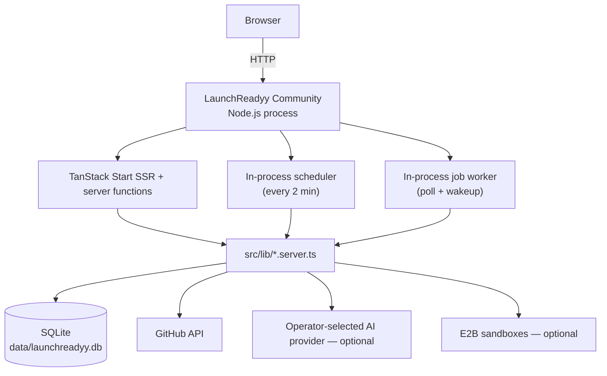
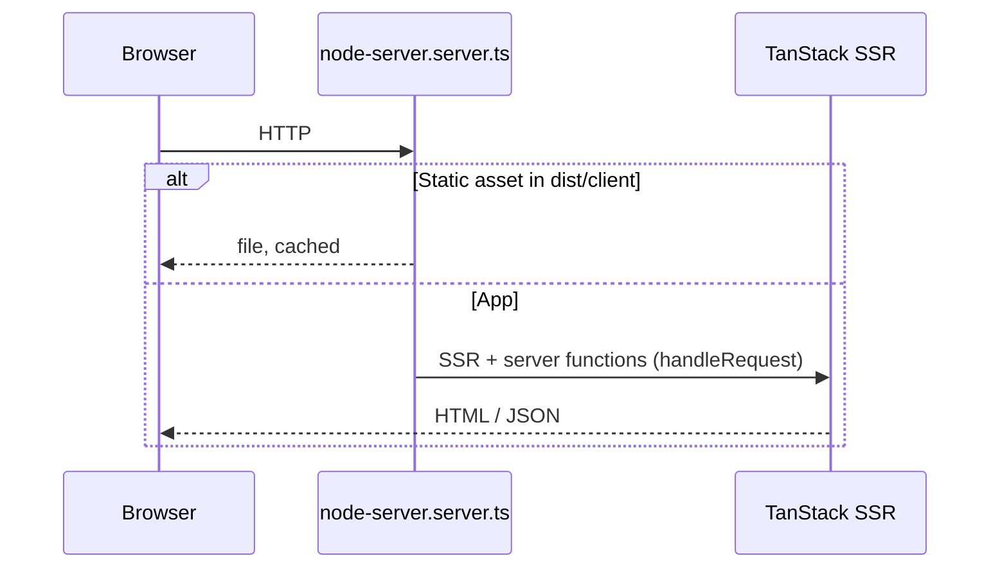

# 2. System Architecture

LaunchReadyy Community runs as one Node.js process containing the web server, background job
worker, and scheduler. The first request starts the background services through
`startBackgroundServices()` in `src/server.ts`; the poll loop in `src/lib/jobs.server.ts` drains
durable jobs and runs scheduled work.

## Request path

## Data + control flows

| Flow | Entry | Side effects |
| ---- | ----- | ------------ |
| Scan | Server fn → `runScan` | `scans`, `issues`, knowledge facts |
| Fix | Durable job | AI/templates → optional sandbox → GitHub PR |
| Sandbox | Durable job | `sandbox_verify_runs`, score gating |
| Live site | Durable job | `live_site_scans` |
| Repo monitoring | Scheduler tick | re-scan, regression notice — [§18](18-monitoring.md) |

Details: scan [§10](10-scan-system.md), fix [§11](11-fix-system.md), sandbox [§12](12-sandbox.md), AI [§13](13-ai-layer.md).
