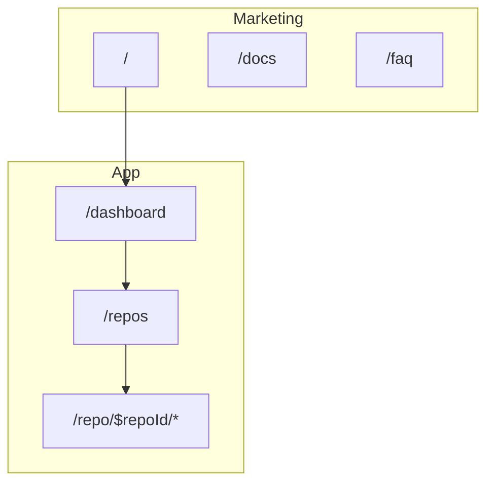

# 5. Frontend

File-based routes under `src/routes/`. Loaders + TanStack Query for data; no separate global store.

## Route map

There's no auth split — every route is reachable by the one local operator, and marketing pages
(`/`, `/docs`, `/faq`, …) sit alongside the app in the same file-based route tree.

| Path | Purpose |
| ---- | ------- |
| `/` | Marketing |
| `/dashboard` | Home base across connected repos |
| `/repos` · `/scans` · `/jobs` · `/reports` | Cross-repo lists |
| `/repo/$repoId` | Scan overview |
| `/repo/$repoId/fix` | Fix picker |
| `/repo/$repoId/blockers` | Launch verdict |
| `/repo/$repoId/sandbox` · `/repo/$repoId/runs` | Sandbox trigger + build history |
| `/repo/$repoId/env` | Encrypted env vars |
| `/repo/$repoId/live-security` | Live domain scan |
| `/repo/$repoId/arch` | Architecture analysis |
| `/repo/$repoId/report` | Shareable report |
| `/repo/$repoId/job/$jobId` | Fix job detail |
| `/pr/$repoId` | Public shared launch report |
| `/settings` | Vendor credentials, background monitoring, data, security |

Public product docs UI: `/docs` (in-app help center). Repo technical docs: `docs/` in git.
