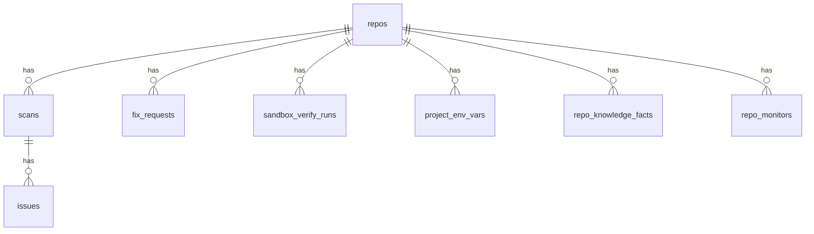

# 7. Database

Single source: [`src/db/migrations/`](../../src/db/migrations/), applied automatically on boot
(`ensureSchema()` in `src/db/schema.ts`) — no manual step, no external database to provision.
Local SQLite file at `data/launchreadyy.db` (WAL mode, foreign keys on).

`src/lib/data-store.server.ts` provides a typed query-builder interface over `better-sqlite3`.
`src/lib/data-store.types.ts` holds the corresponding row types.

## Core tables

| Table | Holds |
| ----- | ----- |
| `repos` | Connected GitHub repos |
| `scans` | Scan rows, scores, file hashes, graphs, `trigger` (`manual` \| `monitor`) |
| `issues` | Findings (fingerprint, evidence, fix_id) |
| `fix_requests` | Fix jobs, pending files, agent_reasoning |
| `background_jobs` | Durable job source of truth — claim/retry/reclaim, see [§11](11-fix-system.md) |
| `sandbox_verify_runs` / `sandbox_slots` / `sandbox_audit_log` | Sandbox status, logs, concurrency slots |
| `project_env_vars` / `project_build_settings` | Encrypted per-repo secrets and build config |
| `repo_knowledge_facts` | Tiered knowledge extracted per scan |
| `live_site_scans` / `live_site_monitors` / `domain_scan_confirmations` | Live security scans and domain ownership |
| `repo_monitors` | Scheduled re-scan state (cadence, last head SHA, last alert) — [§18](18-monitoring.md) |
| `site_config` | Installation notices and maintenance state |
| `risk_acceptances` | Accepted risks / repo learning |
| `category_score_history` / `arch_scans` / `fix_cache` / `ai_test_cache` / `ai_usage` | Trend, caching, and usage bookkeeping |
| `rate_limit_hits` / `short_locks` | Rate limiting and scheduled-work locks |
| `fix_recoveries` / `launch_reports` / `marketing_articles` | Remediation recovery, shareable reports, and project-site content |

## Security model

Single local process, single operator — there's no separate database credential to leak and no
row-level security to configure. Saved project environment variable values are encrypted at rest
(AES-256-GCM, keyed off `ENV_VAR_ENCRYPTION_SECRET`) so a copy of the `.db` file alone doesn't
yield those secrets. `GITHUB_TOKEN` stays in local configuration and is not stored in SQLite.
