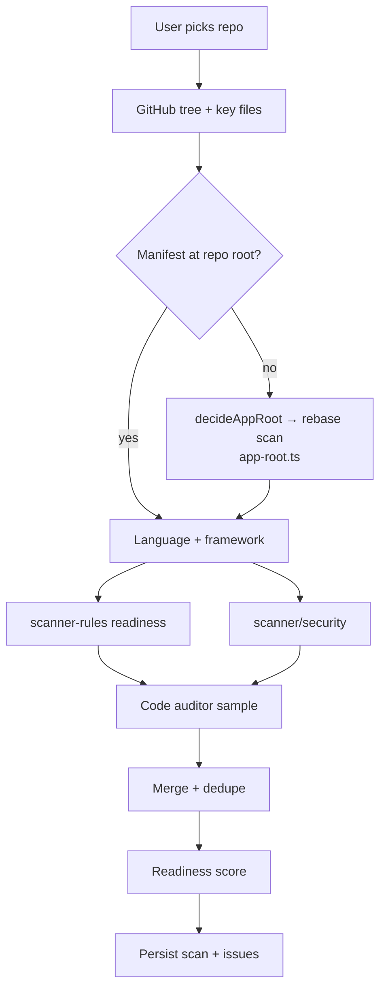

# 10. Scan system

Entry: `runScan` in `src/lib/scan-engine/scan-repository.ts`.

## Notes

- Framework-aware rules (Next, Express, Go, Python, …).
- Code-pattern security checks (`scanner/security/code-patterns.ts`): disabled TLS verification, predictable randomness behind tokens, weak crypto over credentials, path traversal, open redirect, NoSQL injection — across JS/TS, Python, Go, Ruby and PHP.
- GitHub Actions workflows are checked for script injection, `pull_request_target` misuse, token permissions and unpinned actions (`scanner/security/workflow-security.ts`); Dockerfiles for root containers, layer-baked secrets and piped installs (`container-security.ts`). Both read files the scan fetches by name — workflows and Dockerfiles are config, so the auditor source sample never contains them.
- Every finding carries evidence + confidence.
- Knowledge facts written when `flag_repo_knowledge_v2` is on.
- Learning filter (`applyLearning`) suppresses accepted risks on later scans.
- Scans are **not only user-initiated**. `runAndPersistScan` (`scan-run.server.ts`) is the shared path; a manual `triggerScan` also enqueues sandbox verification, scheduled monitoring does not. `scans.trigger` records which. See [§18](18-monitoring.md).
- `checkDependabotAlerts` queries GitHub's live advisory API each run, so findings can change with no commit — this is what makes scheduled re-scans worth running.
- Dependency vulnerabilities come from lockfiles, not manifests. `collectDependencies` (`scanner/security/dependency-inventory.ts`) parses every lockfile in the tree — npm, PyPI, Go, crates.io, RubyGems, Packagist, Hex, NuGet — and OSV is queried with the exact installed versions, transitive ones included. Ranges in `package.json` are used for framework detection only; they cannot answer which version shipped.

## Apps that are not at the repository root

Root detection runs first and always wins when it resolves, so a single-app repo behaves exactly
as it always has. Only a root that resolves to nothing — or a workspace coordinator with no app of
its own (`workspaces`, `pnpm-workspace.yaml`, `turbo.json`, `nx.json`) — looks deeper.

| Concern | Behaviour |
| ------- | --------- |
| Which app | `decideAppRoot` ranks candidates; a backend outranks a frontend, since readiness and security are mostly server properties |
| Scan scope | Rebased onto that directory via `rebaseProvider` — the app is scanned as if it were the root |
| Secrets | **Always whole-repo.** `sampleRepoForSecrets` sweeps every directory regardless of the app dir, so a monorepo cannot hide a key in a sibling package |
| Other apps | Named in a scan warning so the user knows what was not covered |
| Fixes | Generated beneath the same directory — the fix executor resolves it too. See [§11](11-fix-system.md) |
| Empty repo | No manifest and no source anywhere → `UNSUPPORTED_REPO:` warning and score 0, never a fake 100 |

Regression guard: `scripts/scan-baseline.ts` freezes score/framework/fix-ids for every fixture.
`check` exits non-zero on any drift, so it can fail a pipeline; re-run with `write` once the change
is confirmed intended. It runs nightly (`.github/workflows/detection-baseline.yml`), deliberately
not per push: the fixtures are shallow clones of third-party repos, so their contents move when
those upstreams commit, and a guard that fails PRs for reasons nobody here can fix gets ignored.
