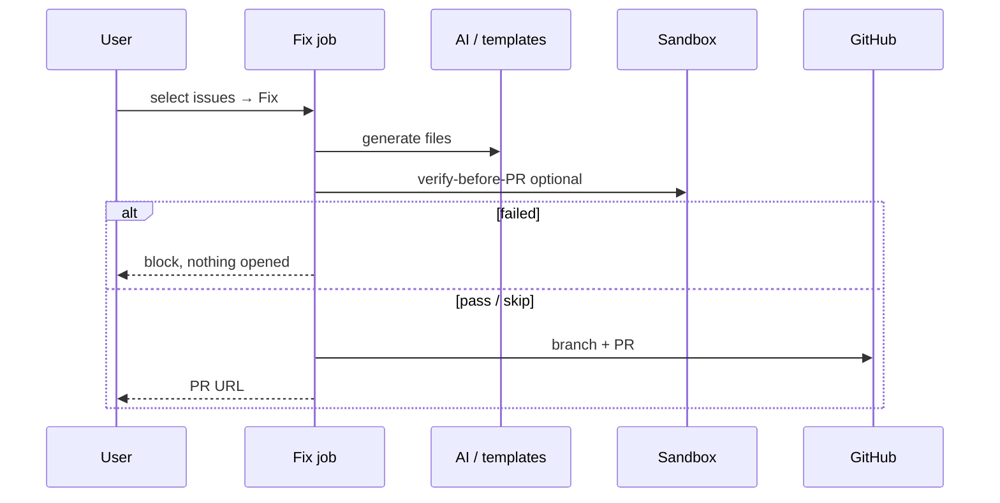

# 11. Fix system

## Pipeline pieces

| Step | Module |
| ---- | ------ |
| Collect templates | `fix-executor/body/` |
| AI tests / README / CI | `ai-tests.server.ts` + `route()` |
| Knowledge inject | `loadRepoKnowledgeContext` |
| Multi-agent trail | `agent-fix.server.ts` (flag off by default) |
| Pre-PR verify | `sandbox-verify/verify-before-pr.ts` |
| Open PR | GraphQL → Trees REST → Contents fallback |
| CI recovery | `ci-watch.server.ts` / fix-recovery |

Lint-only fixes run deterministically with no AI involved; the rest call whichever AI provider
you've configured (or apply a fixed template, also no AI).

## Apps that are not at the repository root

`buildProjectContext` resolves the same app directory the scan did (`scan-engine/app-root.ts`)
and reads `package.json`, manifests and the package manager from **there**, not from a workspace
root that isn't the app.

`collectFixFiles` then places output beneath it. Handlers pass two kinds of path and both keep
working: a constant (`"Dockerfile"`, `"health.py"`) is moved under the app; a path discovered
from the repo tree (`entryPoint`, an auditor target) is left alone, or it would become
`backend/backend/app/main.py`. They are told apart by fact — a path already present in the repo,
or already under the app directory, is used verbatim.

| Output | Location |
| ------ | -------- |
| Build/config/source (`Dockerfile`, `ruff.toml`, `health.py`, middleware) | under the app directory |
| `.github/workflows/**` | repository root (GitHub only reads it there) |
| `README.md`, `.env.example`, `.gitignore`, `LICENSE` | repository root |
| `package.json` script/dep merges | the **app's** manifest, via `patchPackageJson(…, appDir)` |

`runFixPreflight` verifies the result and blocks any build file that still lands outside the app
directory. Proof on real repositories: `scripts/verify-subdir-fix-placement.ts`.
