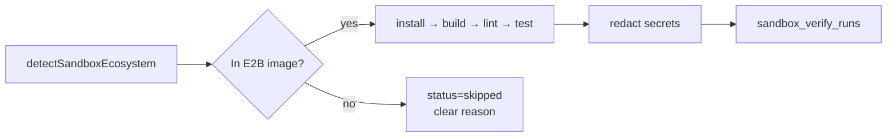

# 12. Sandbox

E2B runs real install/build/lint/test. Template: `launchreadyy/` (`npm run e2b:build:prod`).

## Ecosystems

| Live install/build | Notes |
| ------------------ | ----- |
| Node, Python, Go, Rust, Ruby, PHP, Java, .NET, Elixir | Requires rebuilt `launchreadyy` E2B template |

Go/Rust install under `$HOME` (builder is non-root). Adapter prepends `$HOME/go/bin` and `$HOME/.cargo/bin` to `PATH`.

## Verdict coupling

`computeVerdict()` forces `not_ready` if sandbox **failed**, `conditional` while **queued/running**.

## Image drift is never the operator's repo's fault

`sandboxImageSupports()` claims an ecosystem whenever `E2B_TEMPLATE_ID` is set. If the deployed
template has drifted from `launchreadyy/template.ts` — typically "not rebuilt after a toolchain
was added" — the planned command exits 127 with `go: command not found`. Because a failed run
forces `not_ready`, that would tell a perfectly healthy Go repo it is unfit for production.

`missingImageToolchains()` (`sandbox-verify/failure-classify.ts`) detects exit-127 against a
binary **we** are responsible for providing and marks the run **skipped**, not failed, with a
message saying it is our environment and the score is unaffected. A 127 against a binary the
repo's own script invoked stays a genuine failure.

After changing `template.ts`: `npm run e2b:build:prod` → set `E2B_TEMPLATE_ID` → verify with
`node --env-file=.env --import tsx scripts/verify-sandbox-languages.ts` (expect 11/11).

`JAVA_HOME` is exported at run time from `mise where java` — the Gradle wrapper needs it and
will not accept `java` being on `PATH` alone.
