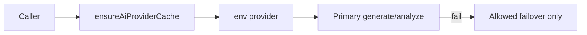

# 13. AI layer

All calls go through `route()` in `src/ai/router.ts`.

## Configuration

Set `AI_PROVIDER` in `.env` (`deepseek | anthropic | openai | gemini | cursor`) plus that
provider's API key. The environment setting is the installation-wide provider selection. When it
is unset, deterministic scanning, scoring, and template fixes still work.

## Failover

With DeepSeek/Claude/Cursor as primary, OpenAI/Gemini are **not** auto-tried (avoids surprise bills). OpenAI/Gemini failover applies when those are the configured primary.

## Providers

DeepSeek · Claude · OpenAI · Gemini · Cursor — each implements `generate` / `analyze`.

## Output quality controls

Generated output is never trusted on sight. Five layers, cheapest first:

| Layer | What it catches | Where |
| ----- | --------------- | ----- |
| Sanitize | markdown fences, an echoed output-path line | `ai-output-sanitize.ts` |
| Structural validation | unbalanced syntax, invalid YAML/JSON/`.env`, empty or fenced output | `fix-validation.ts` |
| Preflight | known CI-breakers, files placed outside the app directory | `fix-preflight.server.ts` |
| **Sandbox verify-before-PR** | the code does not install, build or lint | `sandbox-verify/verify-before-pr.ts` |
| CI watch + auto-refix | failures that only appear in the user's CI | `ci-watch.server.ts` |

**Jobs that generate tests run those tests.** `verifyBeforePr` skips the test step by default —
it is slow and can need services — but a job containing any test-producing fix forces it on
(`producesTests()` in `language-test-fixes.ts`). Otherwise the sandbox proves only that the
project still builds, and a generated suite could reach a pull request unexecuted.

**A PR states its own verification status.** Verification *failing* blocks the PR outright, but
verification *skipping* does not — ordinary conditions can skip it (feature disabled, no sandbox
provider, operator budget reached, unsupported ecosystem, or no commands detected) and the
PR opens unverified. Both notes are built in
`fix-executor/verification-notes.ts` and the body leads with `⚠️ Not verified in a sandbox`,
naming the reason. The skip reason travels as a `reason` field on the note rather than being parsed
back out of the finished sentence, so rewording the message cannot break the banner.

A pass without tests also says so explicitly — "Tests were not run … not that behaviour is
unchanged" — because "build/lint passed" invites the reader to assume more than it means.

## Sampling

`AI_TEMPERATURE = 0.2` (`src/ai/temperature.ts`) is sent on every chat-completion call. Nothing
was set before, so each provider used its own default — DeepSeek's is 1.0, which is wrong for a
product whose entire output is code and structured text. `supportsTemperature()` omits the
parameter for OpenAI reasoning models, which reject it. The Cursor provider is an agent API and
takes no sampling parameter.
