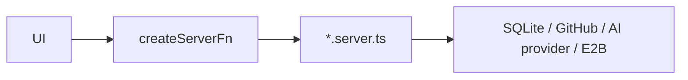

# 14. API

There is no public HTTP/REST surface. All app I/O goes through TanStack Start `createServerFn` —
RPC-style calls from the client bundle straight into a `*.server.ts` module, over `/_serverFn/`
internally. Nothing here is meant to be called from outside the browser session.

## Server function modules

| File | Domain |
| ---- | ------ |
| `github.functions.ts` | Repo dashboard, scan jobs, fix requests, architecture scans, launch reports |
| `db.functions.ts` | Scans, trends, fix requests, risk acceptances |
| `sandbox.functions.ts` | Env vars, build settings, sandbox trigger/status |
| `security.functions.ts` | Domain ownership, live-site scans, AI security explanations |
| `fix-recovery.functions.ts` | CI failure diagnosis and repair |
| `launch-report.functions.ts` | Shareable launch reports |
| `monitor.functions.ts` | Score history, per-repo/live-site monitor toggles, background access |
| `session.functions.ts` | The local operator identity, installation status |
| `site-config.functions.ts` | Feature flags, configured AI provider |

