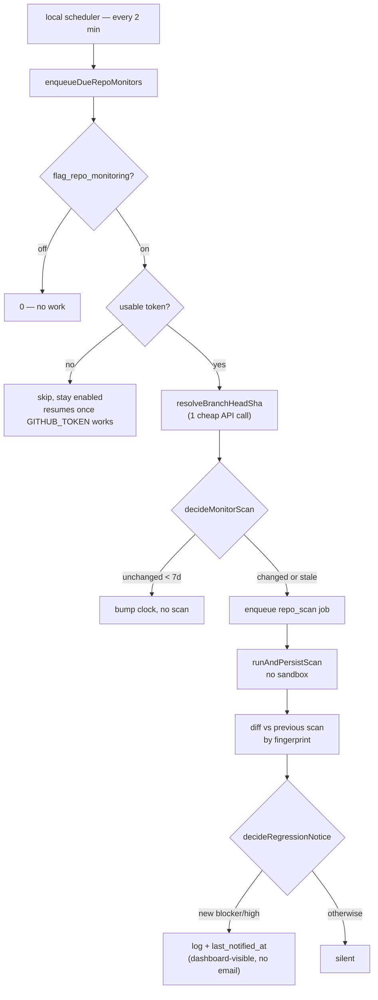

# 18. Continuous monitoring

Scheduled re-scans of connected repos, gated on `flag_repo_monitoring` (**on by default**).

The flag is the installation-wide kill switch, not the per-repo opt-in. A repo is monitored only
once both are true: the operator has a usable GitHub token ([§16](16-security.md)) and the repo has
an enabled `repo_monitors` row.

Why it exists: a one-shot scan is an event, not a habit. Without this, you scan, fix, ship, and
never come back — and findings can change even when the code doesn't, since dependency
vulnerabilities are checked against GitHub's live advisory API on every run.

## Cadence

Repository monitoring uses a weekly cadence (`repoMonitorCadence()` in `repo-monitor.ts` returns
`"weekly"`).

## Cost control

The guard that keeps this cheap is `decideMonitorScan`:

| Head SHA | Last scan | Result |
| -------- | --------- | ------ |
| unchanged | < 7 days | **skip** — one API call, no scan |
| unchanged | ≥ 7 days | scan — picks up new advisories against frozen code |
| changed | any | scan |
| lookup failed | any | scan — fails open, so a GitHub blip can't silently stop monitoring |

A skip still bumps `last_enqueued_at`; without that the monitor is re-evaluated on every 2-minute
tick.

## What an automatic scan never does

`runAndPersistScan` takes an `enqueueSandbox` flag, and monitor runs pass `false` — a scheduled
tick never starts an E2B sandbox run.

## When it surfaces a regression

`decideRegressionNotice` triggers on **new blocker/high findings**, never on score movement alone.

The scorer confines blocker repos to `[0,39]` and clean repos to `[40,100]` (`readiness/scorer.ts`).
One new blocker therefore shows up as a ~45-point cliff that says nothing about how much worse the
repo got. A score-delta alert would scream the same false magnitude every time, so a band crossing
is described in words instead — logged server-side, and visible on the dashboard via
`last_notified_at` and scan history. There is no email in Community.

Suppressed when: it's the repo's first scan (no baseline), only low/medium findings are new, or
another notice already went out this cadence period (`last_notified_at`).

## The GitHub token for background runs

A scheduler tick has no request in flight, so `repo-scan` jobs read the operator's `GITHUB_TOKEN`
from local configuration when they execute — see [§16](16-security.md).

A 401/403 from GitHub disables the operator's repo monitors; the operator re-enables them from
Settings once `GITHUB_TOKEN` is fixed.

## Files

| Piece | Where |
| ----- | ----- |
| Cadence + cost-guard policy (pure) | `src/lib/services/repo-monitor.ts` |
| Scheduler | `src/lib/services/repo-monitor.server.ts` |
| Job processor | `src/lib/services/repo-scan-job.server.ts` |
| Notify rule (pure) | `src/lib/services/repo-regression.ts` |
| Shared scan runner | `src/lib/scan-run.server.ts` |
| GitHub token source | `src/lib/github-token.server.ts` |
| UI | `src/components/monitoring-panel.tsx` (sparkline + per-repo pause), `src/routes/settings.tsx` (installation-wide toggle) |

## Not built

- Push/PR webhook gate. Needs a GitHub App (webhook registration over a personal access token
  requires re-consent per repo; check runs are App-only), ref-aware snapshot fetching
  (`getRepoSnapshot` takes no ref and caches by `fullName`), and a delivery→installation mapping.
  See [§17](17-known-issues.md).
